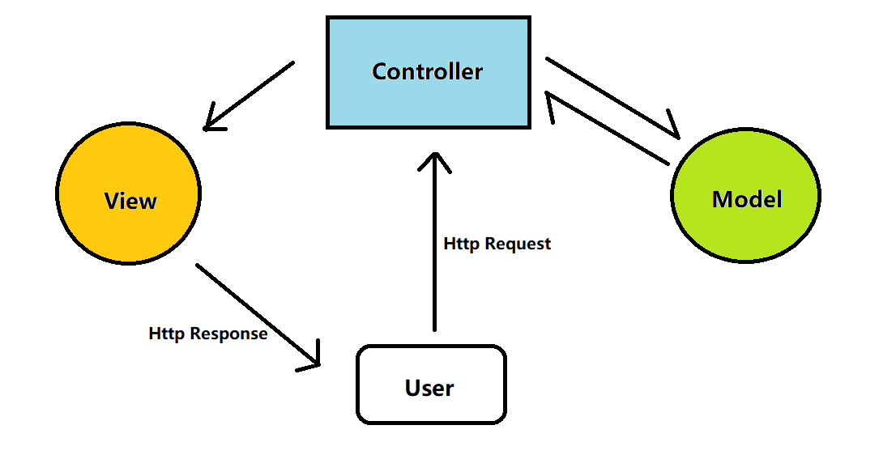

> 这是2023年3月24日举办的2021级**工程常用工具介绍**技术分享的文档

# git

配置用户名和邮箱

```shell
git config --global user.name "xxx"
git config --global user.email "xxx@xxx.com"
```

配置ssh

```
git clone 
```

```
git add
```

```
git commit -m ""
```

```
git push origin dev
```


# C++

## vscode插件

- GitLens
- C/C++
- CMake
- remote-SSH

## vim

- 命令模式：


- 编辑模式，进入方式：
  - i：从光标所在位置开始输入
  - a：从光标所在的下一个字符开始输入
  - o：从光标所在行的下一行新的一行开始输入
  - r：取代光标所在的字符一次
- 末行模式，输入冒号进入：
  - w
  - q
  - wq
  - q!
  - set nu
  - set nonu
  - /
  - %s/替换前的文本/替换后的文本/g
- 块可视化模式：ctrl+v进入

## cmake

```cmake
cmake_minimum_required(VERSION 3.14.0)
project(xxx)
file(GLOB_RECURSE CPP_FILES ${CMAKE_CURRENT_SOURCE_DIR}/src/*.cpp) 
add_executable(${PROJECT_NAME} ${CPP_FILES})
include_directories(
    ${CMAKE_CURRENT_SOURCE_DIR}/include
)
add_compile_options(-std=c++11)
```

```bash
cmake -DCMAKE_BUILD_TYPE=Debug ..
cmake -DCMAKE_BUILD_TYPE=Release ..
```


## gdb

```bash
cmake .. -DCMAKE_BUILD_TYPE=Debug
```

```bash
gcc -g
```

```
r
l
b
info b
p
bt
```

## CI

> 频繁将代码集成到主干，通过自动化测试，快速对产品进行迭代


# Java

## 准备：使用docker快速搭建MySQL5.6环境

```
docker run -p 3307:3306 -e MYSQL_ROOT_PASSWORD=123456 -d --name mysql-1 --restart=always -v mysqlData:/var/lib/mysql mysql:5.6
```

- docker run ：创建一个新的容器并运行一个命令
- 将容器的3306端口映射到宿主机的3307端口
- MySQL的root用户密码初始化为123456
- 后台运行容器
- 指定容器名称为mysql-1
- 容器退出时总是重启
- 挂载主机目录

```
docker exec -it mysql-10 /bin/bash  
```

```sql
DROP TABLE IF EXISTS `user`;
CREATE TABLE `user` (
  `uid` int(100) NOT NULL,
  `username` varchar(255) DEFAULT NULL,
  `password` varchar(255) DEFAULT NULL,
  `email` varchar(255) DEFAULT NULL,
  PRIMARY KEY (`uid`)
) ENGINE=InnoDB DEFAULT CHARSET=utf8;
```


## springboot快速搭建javaweb项目

>Spring就是一个大工厂，可以将所有对象的创建和依赖关系的维护，交给Spring管理。
>
>Spring提供面向切面编程，可以方便的实现对程序进行权限拦截、运行监控等功能。
>
>Spring Boot的设计目的是用来简化Spring应用的创建、运行、调试、部署等。使用Spring Boot可以做到专注于Spring应用的开发，而无需过多关注XML的配置。

当我们创建一个 SpringBoot 工程时，默认 resources 目录下就有一个 application.properties 文件，可以在 application.properties 文件中进行项目配置，例如数据库的配置：

```
spring.datasource.driver-class-name=com.mysql.jdbc.Driver
spring.datasource.url=jdbc:mysql://ip:port/database?characterEncoding=utf8&useSSL=false
spring.datasource.username=
spring.datasource.password=
```

pom.xml

```
<dependencies>
	<dependency>
		<groupId>org.springframework.boot</groupId>
		<artifactId>spring-boot-starter-web</artifactId>
	</dependency>
	<dependency>
		<groupId>org.mybatis.spring.boot</groupId>
		<artifactId>mybatis-spring-boot-starter</artifactId>
		<version>2.3.0</version>
		</dependency>
	<dependency>
		<groupId>com.mysql</groupId>
		<artifactId>mysql-connector-j</artifactId>
		<scope>runtime</scope>
	</dependency>
	<dependency>
		<groupId>org.springframework.boot</groupId>
		<artifactId>spring-boot-devtools</artifactId>
		<scope>runtime</scope>
		<optional>true</optional>
	</dependency>
	<dependency>
		<groupId>org.projectlombok</groupId>
		<artifactId>lombok</artifactId>
		<optional>true</optional>
	</dependency>
	<dependency>
		<groupId>org.springframework.boot</groupId>
		<artifactId>spring-boot-starter-test</artifactId>
		<scope>test</scope>
	</dependency>
	<dependency>
		<groupId>com.baomidou</groupId>
		<artifactId>mybatis-plus-boot-starter</artifactId>
		<version>3.5.3.1</version>
	</dependency>
</dependencies>
```


## springMVC



model-view-controller

- model：数据逻辑与业务
- view：数据的显示
- controller：用户交互

@Controller：分发处理器将会扫描使用了该注解的类的方法，并检测该方法是否使用了@RequestMapping 注解

@Service

@Mapper

@RequestBody：接收POST请求携带的JSON对象，转换成Java对象

@RestController：等同于@Controller + @ResponseBody

@RequestMapping：处理请求地址映射的注解，标记的方法会被分发处理器扫描识别，将不同的请求分发到对应的接口上

@ResponseBody：将controller的方法返回的对象通过适当的转换器转换为指定的格式之后，写入到response对象的body区，通常用来返回JSON数据或者是XML数据


## Mybatis-Plus

```
<dependency>
	<groupId>com.baomidou</groupId>
	<artifactId>mybatis-plus-boot-starter</artifactId>
	<version>3.5.3.1</version>
</dependency>
```


## JUint单元测试

> JUnit 是一个Java的单元测试框架。

对于UserController的公共接口进行单元测试

## postman接口测试

使用postman模拟浏览器发送http请求